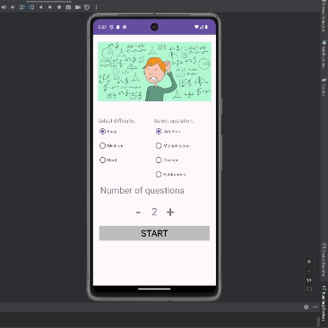

# Math Solver

This project is an arithmetic practice app that was also an exploration into screen management and passing values between separate screens. Later introduced adding toast pop-ups and sound effects through Media Players. 

## Functionality 

The following **required** functionality is completed:

* [ ] Start screen has radio buttons to pick difficulty and operation.
* [ ] User can solve problems in the question screen.
* [ ] User can see their score upon returning to the start screen.
* [ ] User gets a toast and sound effect when answering that indicates if the answer is correct. 

The following **extensions** are implemented:

* safeargs
* Math
* MediaPlayer

## Video Walkthrough

Here's a walkthrough of implemented user stories:

## Notes

I encountered many issues with the safeargs plugin, as it would not create the necessary directions files that it should have, despite me rebuilding the project, changing versions, and trying many other means of getting it to load properly. It wasn't until I updated Gradle and all plugins that safeargs worked.
Otherwise I encountered few issues.

## License

    Copyright [2023] [Kenneth Harper]

    Licensed under the Apache License, Version 2.0 (the "License");
    you may not use this file except in compliance with the License.
    You may obtain a copy of the License at

        http://www.apache.org/licenses/LICENSE-2.0

    Unless required by applicable law or agreed to in writing, software
    distributed under the License is distributed on an "AS IS" BASIS,
    WITHOUT WARRANTIES OR CONDITIONS OF ANY KIND, either express or implied.
    See the License for the specific language governing permissions and
    limitations under the License.
